# Monocular Depth Estimation with CNN, Transformers and Fusions

**Kyle Thornton**  
*Johns Hopkins University*

## Abstract

This work is based on research that has gone on to improve monocular depth estimation. The purpose of this work is to show that the fusion of a transformer and CNN model can perform at the same level or outperform the traditional CNN architecture and the pure transformer architecture. This work is based off of the ideas presented in the Depthformer paper and uses an architecture similar to it, albeit without the deformed attention. This paper implements both a pretrained SWIN transformer backbone and typical multiheaded attention version of the transformer architecture and will test which version has the best performance on the dataset. The dataset used for testing is the NYU depth dataset V2. The metrics used to calculate statistical significance are delta score (< 1.25), mean absolute error, and root mean squared error. We found statistical differences between the CNN and both Depthformer models, the Depthformer model and the DPT model, and a difference in average delta between the two Depthformer models.

## 1. Introduction

Monocular depth estimation is an important problem to solve for various applications, whether it be autonomous vehicles, robotics, or 3D reconstruction. Monocular depth estimation will have its place in studies in the future. There are many different architectures and methodologies that researchers have used in order to solve this problem. Some of the first were with convolutional neural networks that used the RGB image to predict the depth mask associated with it. With the introduction of the transformer, and later the vision transformer, many papers have studied the efficacy of vision transformers over the traditional CNN architecture. Many had used a vision transformer backbone with convolutional decoder. But in this study we test the architecture suggested in the paper "DepthFormer: Exploiting Long-Range Correlation and Local Information for Accurate Monocular Depth Estimation". In this architecture it uses both a vision transformer and convolutional encoder and fuses the two features together ending with a convolutional decoder. In this paper we will test the efficacy of this approach and compare it to the ones made previously. The metrics used to determine this are delta thresholds, mean absolute error, and root mean squared error.

## 2. Related Works

There have been great strides recently in the field of monocular depth estimation but this paper focuses mainly on ones that came before the *Depthformer*. In 2014 Eigen and others were able to use a multi scale CNN that demonstrated that global context significantly enhances the depth prediction accuracy. Going from the full image resolution to lower coarser resolutions and using the previous scales as an addition to later scales, as a fusion. This architecture was used not only for depth estimation but for semantic labeling and surface normals. In 2016 another fully convolutional network was created by Laina and others. This contained skip connections and a deeper network but also novel upsampling blocks. In terms of works containing transformers, one of the first was the architecture *Adabins* that used a typical encoder-decoder and then used a transformer encoder to help place them into bins, with upsampling afterward. Around this time the *Dense Prediction Transformer* architecture was being used. It used a transformer encoder, reassembly, and CNN upsampling to perform the task. Similar to the paper in question, in 2022 the Mono-ViT architecture was introduced. It utilized a CNN and transformer encoder then used skip connections when upsampling. However, this paper made use of self supervised learning which is outside the scope of this paper.

## 3. Methods

In this paper we compare two architectures inspired by the *Depthformer* paper, one with a pretrained SWIN transformer and one with no pretraining, to two others, a CNN based depth estimator and a transformer based depth estimator.

### 3.1 Model Architectures

#### 3.1.1 Depthformer

The Depthformer architecture of this paper takes two different approaches, both using a ResNet18 as a CNN backbone. The first uses a SWIN backbone trained to classify images on the COCO 2017 dataset and the other uses traditional multi-headed attention. For the first architecture after going through the convolutional neural network and the SWIN trasformer they are upscaled to match dimensions and concatenated to make 4 features. Which are then fused together using a convolutional neural network. These 4 features are used as skip connections in later upsampling and then a final convolution allows us to get to the desired output (see Figure 8). The multi-headed attention architecture differs in that instead of fusing the different feature maps from two pretrained backbones, we train a full transformer that has ResNet's features as its input. After upsampling they are concatenated together and pased through a convolutional neural net to further lower the features down to one (see Figure 5).

#### 3.1.2 CNN

The CNN architecture that is used in this paper is shown below in overall architecture (see Figure 6) and in individual parts (see Figure 7). The architecture starts similar to the Depthformer, in that it starts with a ResNet encoder, however we used ResNet50 instead of Resnet18. Each feature extracted from the layers of the CNN encoder are used as skip connections that match to a decoder block. The last layer goes through a dense block that repeatedly concatenates features while preserving the height and width of the encoder block. Then it goes through the first of the decoder blocks. Concatenating the previous encoder's output as a skip connection and upsampling the dimensions to match. Then this is passed to a prediction layer that uses deconvolution for upsampling to pass to refinement, while the decoder output is also passed onto the next decoder layer.

#### 3.1.3 DPT

The last of the architectures is the DPT and it is, relatively, the simplest. The architecture that is used is using a ViT backbone and slowly upscaling and fusing the outputs of the encoder into final output that yields the depth map. The upsampling blocks are deconvolutions instead of interpolation in order to make better use of the feature maps provided. The final block is a convolution to decrease the feature size to one.

### 3.2 Model Training

The models were trained on a custom loss that incorporated structural similarity index measure, gradient edge loss, and mean absolute error. The equations and constants were found by an empirical study and decided to be as follows: β × edge loss + α × mean absolute error + SSIM. Where β = 0.1 and α = 0.5. Each model was trained for 20 epochs, had a learning rate of 0.001, and used the Adam optimizer. This was done to ensure that we could determine convergence rate, average loss, average mean absolute error, root mean squared error, and delta threshold. The delta threshold was set at < 1.25 for all of the models.

### 3.3 Dataset

The data was trained on the NYU Depth V2 dataset. The data was split into validation datasets, training datasets, and evaluation datasets with 80%, 10%, and 10% split respectively.

## 4. Results

The results for the metrics described above can be seen in the below table.

| Metric (average) | CNN | Pretrained Depthformer | Depthformer | DPT |
|------------------|-----|------------------------|-------------|-----|
| Loss | 0.006 | 0.006 | 0.006 | 0.009 |
| MSE | 0.021 | 0.021 | 0.020 | 0.029 |
| MAE | 0.010 | 0.011 | 0.011 | 0.017 |
| Delta (< 1.25) | 98.77 | 98.39 | 98.53 | 96.16 |

**Table 1:** Metrics

Training data set loss along with validation losses are in plots below: Figures 10-13.

In terms of statistical differences, we rejected the null hypothesis that there would be no difference between the different models, when comparing to the pretrained Depthformer, with an α of 0.01. In our findings we found that the CNN was statistically different than the non-pretrained Depthformer in average loss, average MAE, and average delta. And statistically different to the pretrained Depthformer in all metrics. We found that the DPT had statistical difference to both the pretrained and non-pretrained version of the Depthformer across all metrics, with the same value of α. For the differences between the two Depthformers we found that there was a statistically significant difference in the delta values of the two. The CNN performed the best, in average metric across the board. The non pretrained Depthformer performed close behind the CNN and the pre-trained Depthformer and DPT followed after.

## 5. Discussion

These results lead us to answer our research questions. Is the Depthformer superior to CNN encoder architectures? Is the Depthformer superior to transformer encoder based architectures? Lastly, will pretraining a transformer backbone boost performance of the Depthformer? Our results point to, for the first question, no this Depthformer architecture is not superior to the this CNN architecture for monocular depth perception. However, the non-pretrained Depthformer had around 1/4 the parameters of the CNN and pretrained Depthformer and was able to perform nearly on par with both of them. Which leads me to suggest further research in determining whether with more parameters the non-pretrained Depthformer could attain the same level as the CNN or surpass it.

This also indicates to me that while there was no metric other than the delta that the non-pretrained Depthformer outperformed the pre-trained version the parameter difference, roughly 3/10 of the parameter size, indicates that if equal the non-pretrained Depthformer could further surpass the pretrained version.

This belief is further justified when testing the output on random indeces from the training, testing, and validation datasets. These are the depth masks predicted by the four models on the same image.

  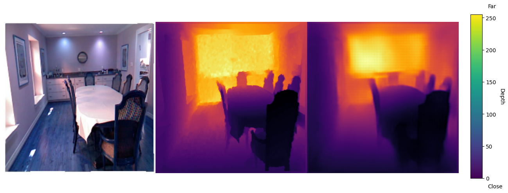
   
  <em>Figure 1: Depthformer Output</em>

  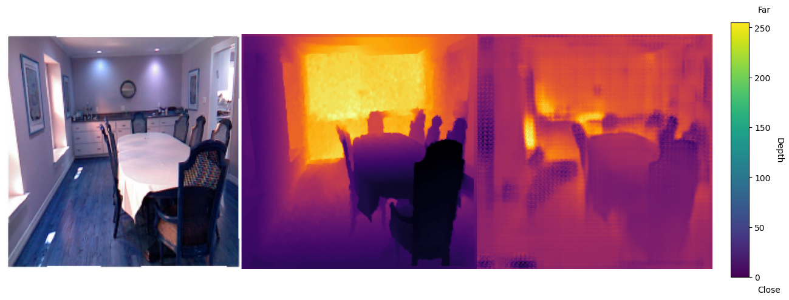
   
  <em>Figure 2: CNN Output</em>

  
   
  <em>Figure 3: Depthformer (pretrained) Output</em>

  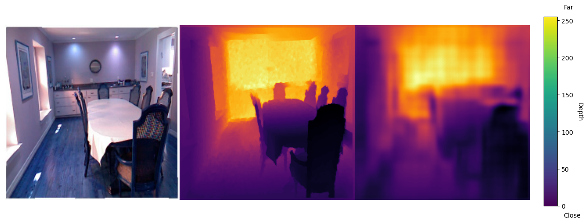
   
  <em>Figure 4: DPT Output</em>

While images do not show any quantitative results, these images show the issues with using the pretrained backbones on the Depthformer and the power of ResNet50 in the CNN only encoder. The pretrained Depthformer ends up with patches not being smoothed, an issue most likely due to poor fusion of the Swin and CNN features. Whereas the CNN only encoder architecture maintains the outline of almost all objects. The smoothest of the images was the non-pretrained Depthformer. Highlighting the fact that it was able to produce nearly similar results with fewer parameters, an area that could be explored in the future.

## References

1. Hu, J., Zhang, Y., and Okatani, T. Visualization of convolutional neural networks for monocular depth estimation. *CoRR*, abs/1904.03380, 2019.

2. Zhao, C., Zhang, Y., Poggi, M., Tosi, F., Guo, X., Zhu, Z., Huang, G., Tang, Y., and Mattoccia, S. Monovit: Self-supervised monocular depth estimation with a vision transformer. *2022 International Conference on 3D Vision (3DV)*, 668-678, 2022.

3. Laina, I., Rupprecht, C., Belagiannis, V., Tombari, F., and Navab, N. Deeper depth prediction with fully convolutional residual networks. *CoRR*, abs/1606.00373, 2016.

4. Eigen, D. and Fergus, R. Predicting depth, surface normals and semantic labels with a common multi-scale convolutional architecture. *CoRR*, abs/1411.4734, 2014.

5. Bhat, S. F., Alhashim, I., and Wonka, P. Adabins: Depth estimation using adaptive bins. *CoRR*, abs/2011.14141, 2020.

6. Li, Z., Chen, Z., Liu, X., and Jiang, J. Depthformer: Exploiting long-range correlation and local information for accurate monocular depth estimation. *Machine Intelligence Research*, 20(6):837-854, 2023.

7. Ranftl, R., Bochkovskiy, A., and Koltun, V. Vision transformers for dense prediction. *CoRR*, abs/2103.13413, 2021.

8. Hafeez, M., Madden, M., Sistu, G., and Ullah, I. Depth estimation using weighted loss and transfer learning. *Proceedings of the 19th International Joint Conference on Computer Vision, Imaging and Computer Graphics Theory and Applications*, 780-787, 2024.

## Appendix

### Architecture Diagrams

  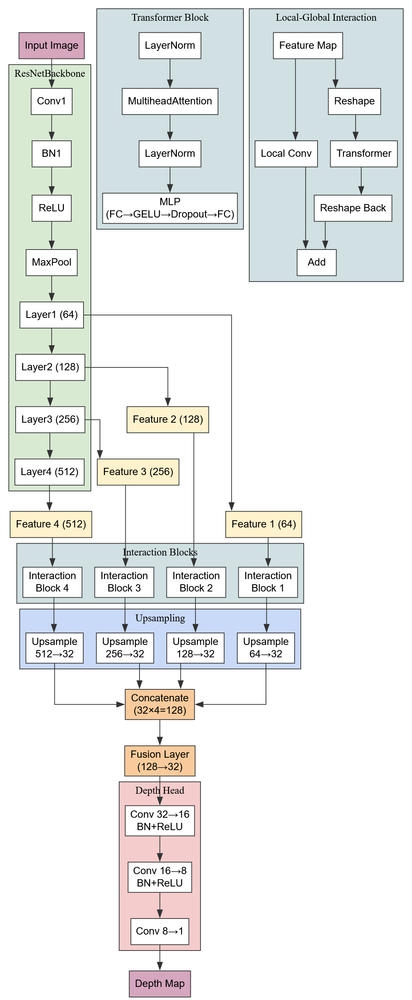
   
  <em>Figure 5: Architecture of Depthformer (No Pretrained SWIN)</em>

  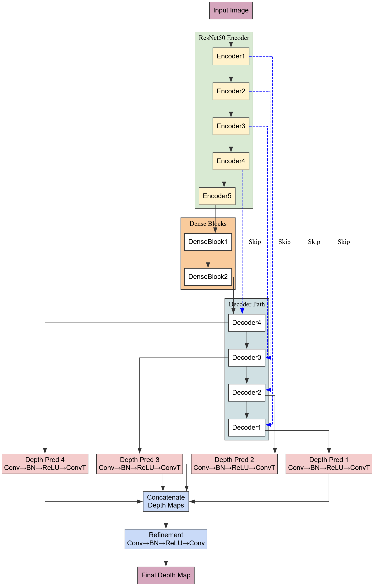
   
  <em>Figure 6: Architecture of CNN Depth Estimator</em>

  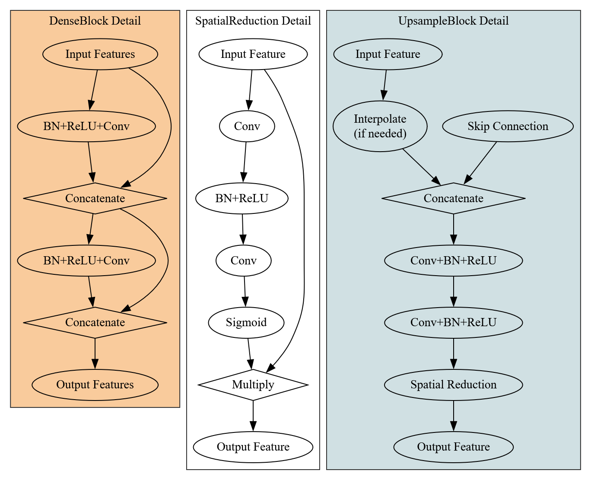
   
  <em>Figure 7: Inner Architecture CNN</em>

  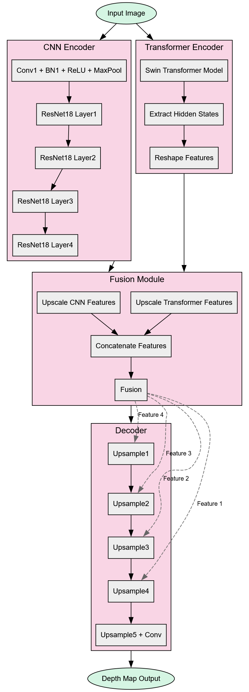
   
  <em>Figure 8: Architecture of SWIN Backbone Transformer</em>

  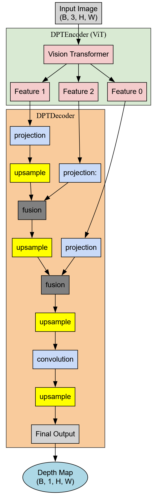
   
  <em>Figure 9: Architecture of DPT</em>

### Training Loss Plots

  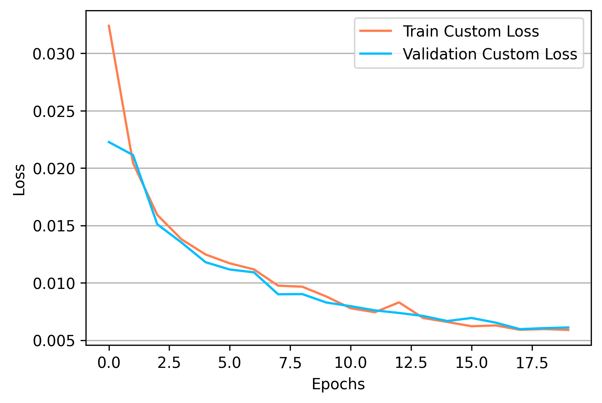
   
  <em>Figure 10: CNN Depth Estimator loss</em>

  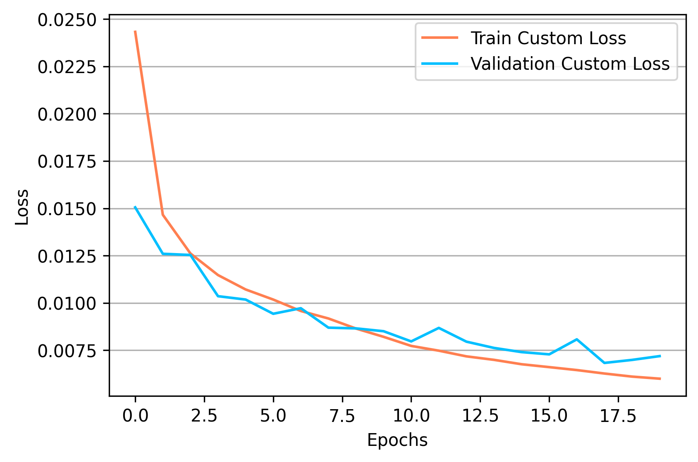
   
  <em>Figure 11: Depthformer (Pretrained) loss</em>

  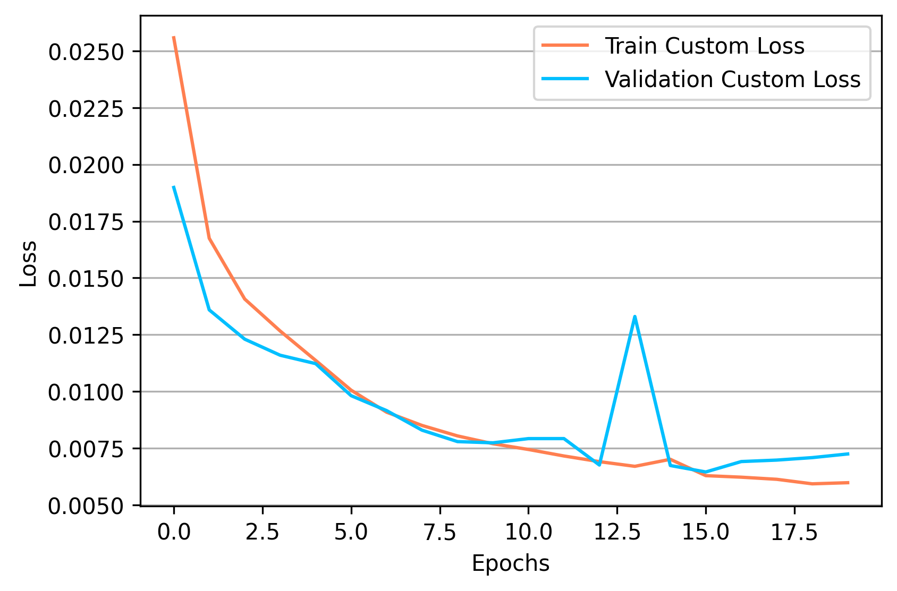
   
  <em>Figure 12: Depthformer loss</em>

  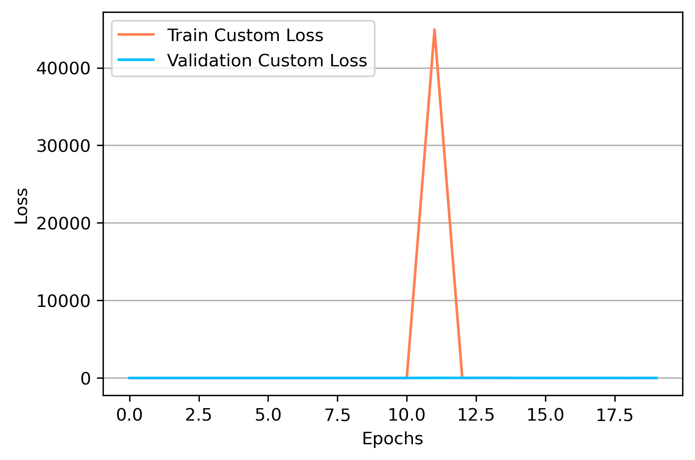
   
  <em>Figure 13: DPT loss</em>

